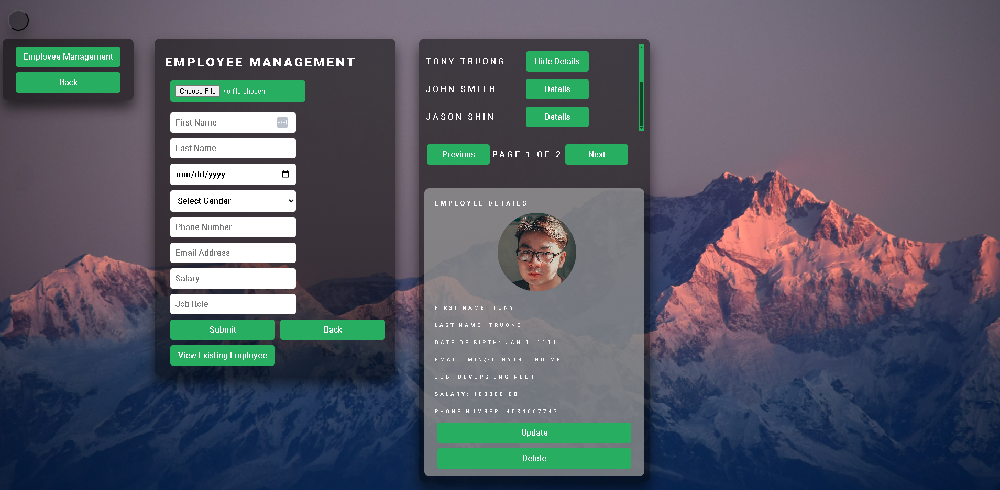

# Employee Management System

## Introduction
This Employee Management System is designed to streamline the process of managing employee records efficiently. Built with Next.js on the frontend and Node.js on the backend, this project serves as a practical learning venture into understanding and implementing basic Create, Read, Update, and Delete (CRUD) operations. Additionally, the application incorporates bcrypt and JSON Web Tokens (JWT) to practice implementing security and authentication measures. These technologies ensure that user data is securely managed and that all interactions with the system are authenticated, providing a secure environment for managing sensitive employee information. 

## Overview

### Login Form


### Signup Form


### Home Menu


### Employee Management


### JWT Authentication


## Features
- **Create Employee Records**: Add new employee details into the system.
- **Read Employee Information**: View the list of all employees and their details.
- **Update Employee Details**: Modify the information of existing employees.
- **Delete Employee Records**: Remove employee details from the system.

## Technologies Used
- **Frontend**: 
  - Next.js (13.5.4) - The React framework for production.
  - React (18.2.0) - A JavaScript library for building user interfaces.
  - React DOM (18.2.0) - Serves as the entry point to the DOM and server renderers for React.
  - React Router DOM (6.21.3) - DOM bindings for React Router.

- **Backend**: 
  - Node.js - A JavaScript runtime built on Chrome's V8 JavaScript engine.
  - Express (4.18.2) - Fast, unopinionated, minimalist web framework for Node.js.
  - Nodemon (3.0.1) - A utility that monitors for any changes in your source and automatically restarts your server.
  - Prisma (5.9.0) - Next-generation ORM for Node.js and TypeScript.
  - Sequelize (6.33.0) - A promise-based Node.js ORM for Postgres, MySQL, MariaDB, SQLite, and Microsoft SQL Server.

- **Authentication and Security**: 
  - Next-Auth (4.24.5) - Authentication for Next.js.
  - Passport (0.7.0) - Simple, unobtrusive authentication for Node.js.
  - Passport-Local (1.0.0) - Local username and password authentication strategy for Passport.
  - bcrypt (5.1.1) - A library to help you hash passwords.
  - jwt (jsonwebtoken) (9.0.2) - An implementation of JSON Web Tokens.

- **Data Handling and Validation**: 
  - Multer (1.4.5-lts.1) - Middleware for handling `multipart/form-data`.
  - Express Validator (7.0.1) - An express.js middleware for validator.

- **Utilities and Development Tools**: 
  - AWS SDK (2.1546.0) - The AWS SDK for JavaScript, providing JavaScript objects for AWS services.
  - Dotenv (16.4.1) - Loads environment variables from a `.env` file into `process.env`.
  - ESLint (8.51.0) - The pluggable linting utility for JavaScript and JSX.

- **Session Management**: 
  - Express-Session (1.18.0) - Simple session middleware for Express.

## Getting Started
These instructions will get you a copy of the project up and running on your local machine for development and testing purposes.

### Prerequisites
- Node.js
- NPM

### Installation
1. Clone the repo
   ```sh
   git clone https://github.com/ttruong11/employee-management.git
   ```

## API Routes

### Employee Management

- **DELETE `/api/employees/:id`**
  - Deletes an employee by ID.
  - Requires a numeric `id` parameter.

- **PUT `/api/employees/:id`**
  - Updates an employee's details by ID.
  - Accepts `first_name`, `last_name`, `dob`, `email`, `job_role`, `salary`, `gender`, and `phone_number` in the request body.

- **GET `/api/employees`**
  - Retrieves a paginated list of employees.
  - Optional query parameters: `page`, `limit`.

- **GET `/api/employee-metrics`**
  - Provides metrics such as the total number of employees and the sum of salaries.

### User Authentication and Management

- **POST `/api/register`**
  - Registers a new user.
  - Accepts `username`, `email`, and `password` in the request body.

- **POST `/api/login`**
  - Authenticates a user.
  - Accepts `username` and `password` in the request body.

- **GET `/api/users`**
  - Retrieves a list of all users.

- **GET `/api/users/get-password/:username`**
  - Retrieves the hashed password of a specific user by username.

- **PUT `/api/users/update-username/:username`**
  - Updates a user's username.
  - Requires the new `username` in the request body.

- **PUT `/api/users/update-password/:username`**
  - Updates a user's password.
  - Requires the new `password` in the request body.

### File Uploads

- **POST `/upload`**
  - Uploads an image file.
  - The file should be included in the request with the key `image`.

### Miscellaneous

- **POST `/api/chatbot`**
  - Processes responses from a chatbot interface.
  - Accepts `responses` and `task` in the request body, where `responses` is an object containing user responses to questions, and `task` is a string representing the selected task.
